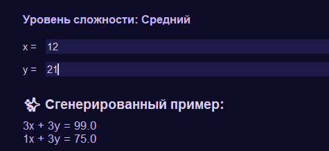

# 🧮 Генератор уравнений и неравенств

<div align="center">

[](https://www.python.org/)
[](https://docs.python.org/3/library/tkinter.html)
[](https://github.com/Kango911/EquationK9generator)
[](LICENSE)
[]()

**✨ Мощный генератор математических уравнений и неравенств для преподавателей и студентов ✨**

[](https://github.com/Kango911/EquationK9generator/releases/latest)
[](https://github.com/Kango911/EquationK9generator/issues)

</div>

---

## 📸 Скриншоты

<div align="center">
  
*Интерфейс программы в работе*

| Главное меню | Выбор задания | Генерация примера |
|--------------|---------------|-------------------|
|  |  |  |

</div>

---

## 🎯 О программе

**Генератор уравнений и неравенств** — это интерактивное приложение с графическим интерфейсом, созданное для помощи преподавателям и студентам в изучении математики. Программа генерирует примеры по обратному принципу: вы задаёте **ответ** и **тему**, а она создаёт **уравнение или неравенство** с этим решением.

> **💡 Идея:** Вместо того чтобы искать готовые примеры, вы просто вводите нужный ответ — программа сама придумывает подходящее уравнение. Идеально для составления контрольных работ и домашних заданий!

---

## 🌟 Ключевые возможности

| Возможность | Описание |
|-------------|----------|
| 📐 **10+ разделов** | От линейных уравнений до тригонометрии и систем |
| 🎚️ **3 уровня сложности** | Лёгкий, Средний, Сложный (для оценок 3, 4, 5) |
| 💡 **Пошаговое решение** | Подробный разбор каждого сгенерированного примера |
| ❓ **Встроенная справка** | Описание всех разделов и инструкции по использованию |
| 🎨 **Красивый интерфейс** | Приятная фиолетовая цветовая схема, адаптивный дизайн |
| 📦 **Готовый установщик** | Простая установка на Windows в один клик |
| 🚀 **Мгновенная генерация** | Примеры создаются за доли секунды |

---

## 📚 Поддерживаемые разделы

<div align="center">

| Раздел | Уравнения | Неравенства | Системы |
|--------|:---------:|:-----------:|:-------:|
| **Линейные** | ✅ | ✅ | ❌ |
| **Квадратные** | ✅ | ✅ | ❌ |
| **Кубические** | ✅ | ❌ | ❌ |
| **Рациональные** | ✅ | ✅ | ❌ |
| **Иррациональные** | ✅ | ✅ | ❌ |
| **Показательные** | ✅ | ✅ | ❌ |
| **Логарифмические** | ✅ | ✅ | ❌ |
| **Тригонометрические** | ✅ | ✅ | ❌ |
| **Системы линейных** | ❌ | ❌ | ✅ |
| **Системы нелинейных** | ❌ | ❌ | ✅ |

</div>

---

## 🎚️ Уровни сложности

| Уровень | Описание | Для кого |
|---------|----------|----------|
| 🟢 **Лёгкий** | Простые коэффициенты (от -3 до 3), базовые примеры | Для оценки «3» |
| 🟡 **Средний** | Более сложные уравнения с дробями и корнями | Для оценки «4» |
| 🔴 **Сложный** | Громоздкие уравнения с большими коэффициентами, смешанные функции | Для оценки «5» |

---

## 🚀 Установка и запуск

### 📦 Вариант 1: Готовый установщик (рекомендуется)

<details>
<summary><b>Нажмите для подробной инструкции</b></summary>

1. Скачайте последнюю версию установщика из [раздела Releases](https://github.com/Kango911/EquationK9generator/releases)
   - Файл: `EquationGenerator_Setup.exe`
2. Запустите скачанный файл
3. Следуйте инструкциям установщика:
   - Выберите папку для установки (по умолчанию `C:\Program Files\EquationGenerator`)
   - Выберите, создавать ли ярлыки на рабочем столе и в меню «Пуск»
4. Нажмите «Установить»
5. После установки запустите программу через ярлык на рабочем столе или в меню «Пуск»

</details>

### 🐍 Вариант 2: Запуск из исходного кода

<details>
<summary><b>Нажмите для подробной инструкции</b></summary>

```bash
# Клонируйте репозиторий
git clone https://github.com/Kango911/EquationK9generator.git
cd EquationK9generator

# Убедитесь, что у вас установлен Python 3.8+
python --version

# Запустите программу
python main.py
```

> **Примечание:** Для работы требуется только стандартная библиотека Python (Tkinter идёт в комплекте). Дополнительных зависимостей нет.

</details>

---

## 🎮 Как пользоваться

<div align="center">

### 📌 Пошаговая инструкция

</div>

1. **Выберите тему** на главном экране (например, «Квадратные уравнения»)
2. **Выберите тип задания** (уравнение или неравенство)
3. **Выберите уровень сложности** (Лёгкий/Средний/Сложный)
4. **Введите ответ** (корень, границу или координаты)
5. Нажмите **«Сгенерировать»** — программа создаст пример
6. Нажмите **«Показать решение»** — увидите пошаговый разбор

---

### 📝 Примеры ввода

| Раздел | Тип | Что вводить | Пример ввода | Результат |
|--------|-----|-------------|--------------|-----------|
| **Линейное уравнение** | Уравнение | Корень | `5` | `2x - 10 = 0` |
| **Линейное неравенство** | Неравенство | Граница + тип | `3` + `gt` | `2x - 6 > 0` → `x > 3` |
| **Квадратное уравнение** | Уравнение | Корни через пробел | `2 -3` | `x² + x - 6 = 0` |
| **Квадратное неравенство** | Неравенство | Корни + тип | `1 4` + `gt` | `(x-1)(x-4) > 0` |
| **Тригонометрическое уравнение** | Уравнение | Корень в радианах | `0.5236` | `sin(x) = 0.50` |
| **Система линейных** | Система | x и y | `2 3` | `2x + 3y = 13` |

---

### 🔤 Типы решений для неравенств

| Код | Значение | Пример |
|-----|----------|--------|
| `gt` | Больше (`>`) | `x > 3` |
| `lt` | Меньше (`<`) | `x < 3` |
| `ge` | Больше или равно (`≥`) | `x ≥ 3` |
| `le` | Меньше или равно (`≤`) | `x ≤ 3` |

---

### 📐 Тригонометрические углы в радианах

| Угол | Радианы | Значение |
|------|---------|----------|
| 0° | 0 | 0 |
| 30° | π/6 ≈ 0.5236 | sin = 0.5 |
| 45° | π/4 ≈ 0.7854 | sin = 0.71 |
| 60° | π/3 ≈ 1.0472 | sin = 0.87 |
| 90° | π/2 ≈ 1.5708 | sin = 1.0 |
| 180° | π ≈ 3.1416 | sin = 0 |

---

## 🛠️ Технологии

<div align="center">

| Компонент | Технология | Описание |
|-----------|------------|----------|
| **Язык** | Python 3.8+ | Основной язык программирования |
| **Интерфейс** | Tkinter | Встроенная библиотека для GUI |
| **Сборка** | PyInstaller | Создание исполняемого `.exe` файла |
| **Установщик** | Inno Setup | Создание установочного пакета для Windows |

</div>

---

## 📂 Структура проекта

```
EquationK9generator/
├── main.py              # Точка входа в программу
├── gui.py               # Графический интерфейс пользователя
├── generators.py        # Логика генерации примеров
├── constants.py         # Константы, цветовая схема, тексты помощи
├── README.md            # Этот файл
├── installer.iss        # Скрипт для Inno Setup
├── icon.ico             # Иконка программы
├── screenshots/         # Скриншоты для README
│   ├── main_menu.png
│   ├── topic_select.png
│   └── example_generation.png
└── dist/                # Папка со скомпилированным .exe
    └── EquationGenerator.exe
```

---

## 🤝 Как внести вклад

Мы приветствуем любые вклады в проект!

1. **Форкните** репозиторий
2. **Создайте ветку** для новой функции:
   ```bash
   git checkout -b feature/amazing-feature
   ```
3. **Зафиксируйте изменения**:
   ```bash
   git commit -m 'Add amazing feature'
   ```
4. **Отправьте в ваш форк**:
   ```bash
   git push origin feature/amazing-feature
   ```
5. **Откройте Pull Request** в основной репозиторий

---

## 📝 Лицензия

Распространяется под лицензией **MIT**. Подробнее в файле [LICENSE](LICENSE).

```
MIT License

Copyright (c) 2026 Kango911

Permission is hereby granted, free of charge, to any person obtaining a copy
of this software and associated documentation files (the "Software"), to deal
in the Software without restriction, including without limitation the rights
to use, copy, modify, merge, publish, distribute, sublicense, and/or sell
copies of the Software, and to permit persons to whom the Software is
furnished to do so, subject to the following conditions:
...
```

---

## 🙏 Благодарности

- Всем преподавателям и студентам, использующим программу в учебном процессе
- Сообществу Python за вдохновение и поддержку
- [Inno Setup](https://jrsoftware.org/isdl.php) за отличный инструмент для создания установщиков
- Всем, кто тестировал программу и помогал с идеями

---

## 📞 Контакты и поддержка

| Канал | Ссылка                                                                            |
|-------|-----------------------------------------------------------------------------------|
| 🐛 **Сообщить об ошибке** | [GitHub Issues](https://github.com/Kango911/EquationK9generator/issues)           |
| 💡 **Предложить идею** | [GitHub Discussions](https://github.com/Kango911/EquationK9generator/discussions) |
| 📧 **Email** | lipenkov.a61@gmail.com                                                            |
| 🌐 **GitHub** | [Kango911/EquationK9generator](https://github.com/Kango911/EquationK9generator)   |

---

<div align="center">

### ⭐ Не забудьте поставить звезду на GitHub, если проект вам полезен! ⭐

---

**📐✨ Пусть математика станет проще и интереснее с нашим генератором! ✨📐**

</div>